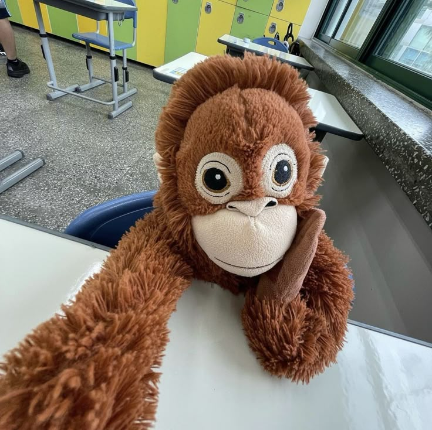

# 사진, 링크 첨부 가이드

---

### 1. 사진 첨부

```
작성 방법


예시
     
```

<<결과>>  
     

---

### 2. 사진 크기 조절

마크다운 문법에는 크기 조절 기능이 없기 때문에 크기 조절이 필요한 경우 HTML으로 작성해야합니다.

```html
작성 방법


예시
  
```

<<결과>>  


---

### 3. 사진에 링크 넣기

#### 3-1 ) 내부 문서로 이동

```
작성 방법
[](문서 경로)

예시
[](Guide.md)
```

<<결과>>  
[](Guide.md)


#### 3-2 ) 외부 링크로 이동

```
작성 방법
[](링크 경로)

예시
[](https://www.google.com)
```

<<결과>>  
[](https://www.google.com)

---

### 4. 외부 링크 첨부

```
작성 방법
[보여줄 글자](링크)

예시
[구글로 이동](https://www.google.com)
```

<<결과>>  
[구글로 이동](https://www.google.com)